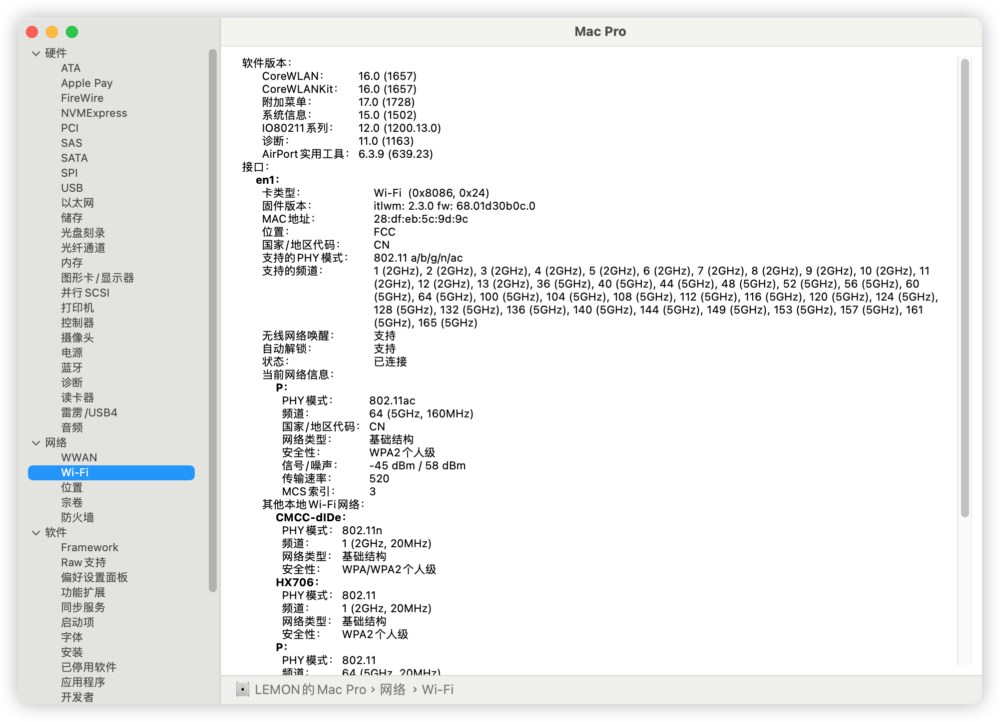
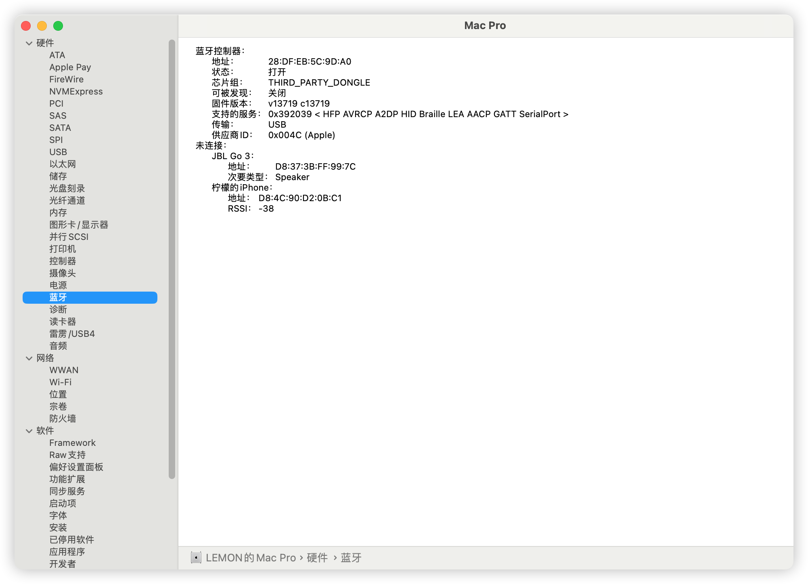
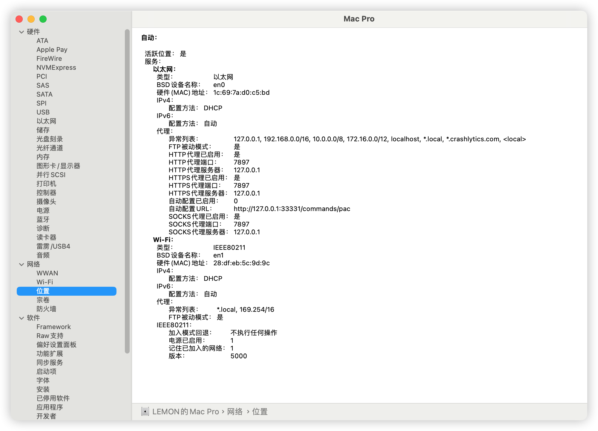
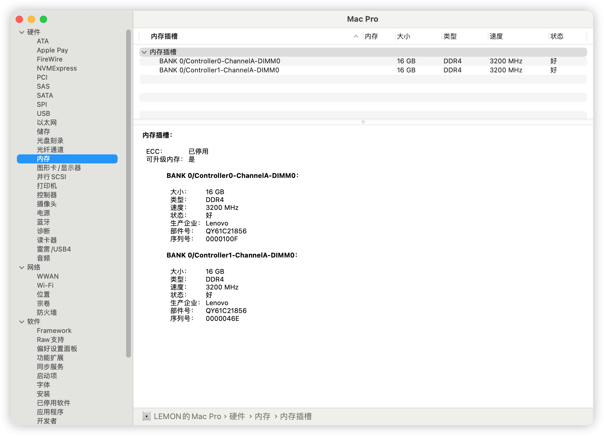
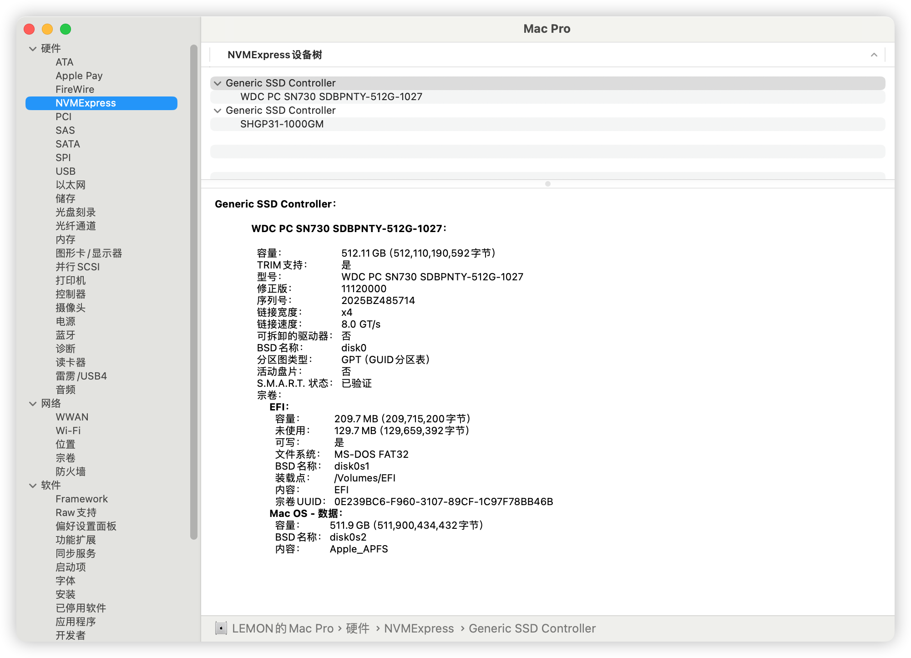
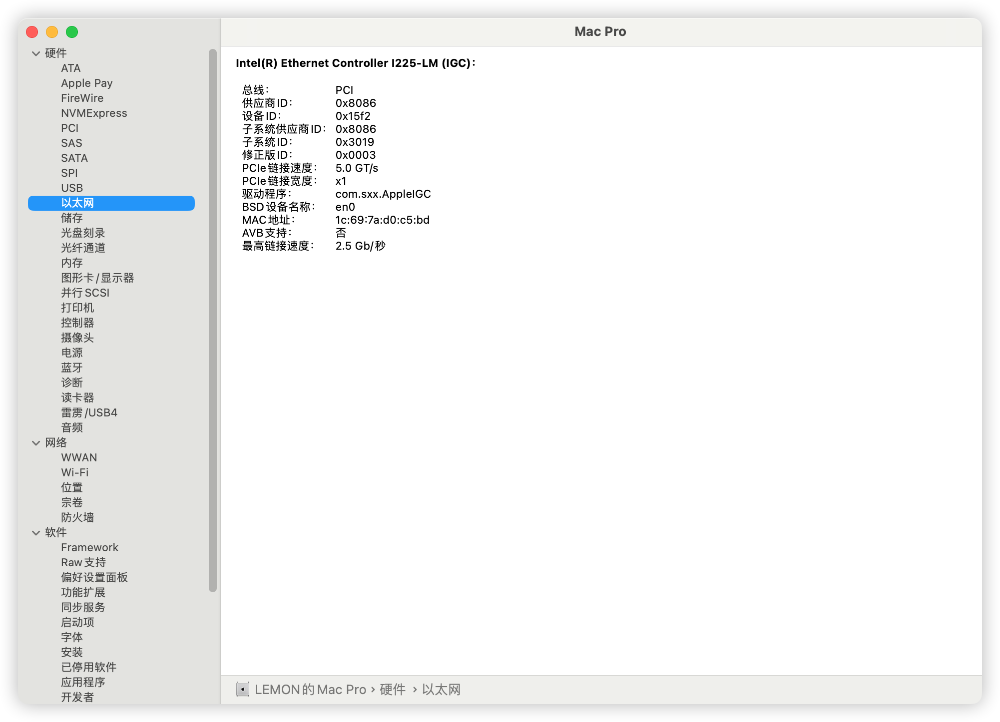
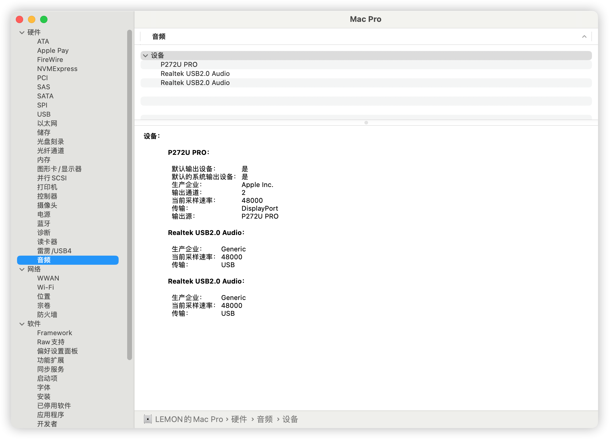

# NUC11

## 适用于 NUC11BTMi7, MacOS Sonoma，Ventura的Hackintosh-EFI引导

## 配置信息

- 计算卡：NUC11BTMI7 i7-11700B
- 有线网卡：Intel® 以太网控制器 i225-LM
- 无线网络/蓝牙：Intel® Wi-Fi 6E AX210
- 声卡：机箱前面板USB声卡
- 显卡：惠普 6600 XT
- 内存：联想 DDR4 16G 3200MHz*2
- 硬盘：西数WDC SN730  512GB
- MacOS版本：Sonoma 14.5
- BIOS版本：0071 

## BIOS 设置

- Advanced
  - Advanced > `PCIE Resizable BAR Support: Disabled`
  - Advanced > Video > `Primary Display: PEG Slot`
  - Advanced > Video > `Internal graphics > Auto or Disabled`
- Security
  - Security Features > `Intel VT for Directed I/O(VT-d)：Disabled`
- Boot
  - Secure Boot > `Secure Boot: Disabled`
  - boot Priority > `Fast Boot: Unchecked`

 ## 硬件驱动情况

- ✅ CPU正常睿频
- ❌ 11代CPU核心显卡无法驱动
- ✅ 独立显卡HP 6600xt正常
- ✅ USB接口已经定制，所有USB接口均可正常使用
- ✅ 声卡驱动正常
- ✅ 自带无线网卡WIFI、蓝牙正常
- ✅ 有线网卡驱动正常
- ✅ 读卡器无SD卡测试，但读卡器走的USB3.2Hub，理论上可以使用
- ✅ 无雷电硬件测试
- ✅ 睡眠及唤醒正常
- ✅ 单项隔空投送（Mac到iPhone）

## 目前问题
- ❌ 启动加载第二阶段黑屏问题

## 进阶方法

### RX6600XT啸叫处理

 ✅RX6600XT降频处理，使用OCAT添加PP_PhmSoftPowerPlayTable可缓解

参考：https://zhuanlan.zhihu.com/p/629023610

### 双系统蓝牙配对优化
 ✅Mac&Win双系统下蓝牙设备共用，无需重复配对
 
参考：https://post.smzdm.com/p/a4p59xe8/

## 更改日志

- 2024 年 8 月 8 日
  - 首次提交
  - 更新`OpenCore` `v1.0.1`
  - 支持`Sonama`安装和使用

## 截图信息

## 参考工具

- OCAT: https://github.com/ic005k/OCAuxiliaryTools
- WiFi网卡：https://github.com/OpenIntelWireless/itlwm
- 蓝牙：https://github.com/OpenIntelWireless/IntelBluetoothFirmware
- BIOS下载：https://www.asus.com.cn/displays-desktops/nucs/nuc-elements/nuc-11-extreme-compute-element/helpdesk_bios/?model2Name=NUC-11-Extreme-Compute-Element
- MacOS镜像：https://hackintosh.club/d/10000080
- 镜像烧录工具：Transmac

## 工具软件备份库
QQ群：933908885

### 参考EFI链接：

- https://github.com/zpyangchina/NUC11BTMi7-hackintosh
- https://github.com/xiao-chenxi/NUC11BTMi9-hackintosh
